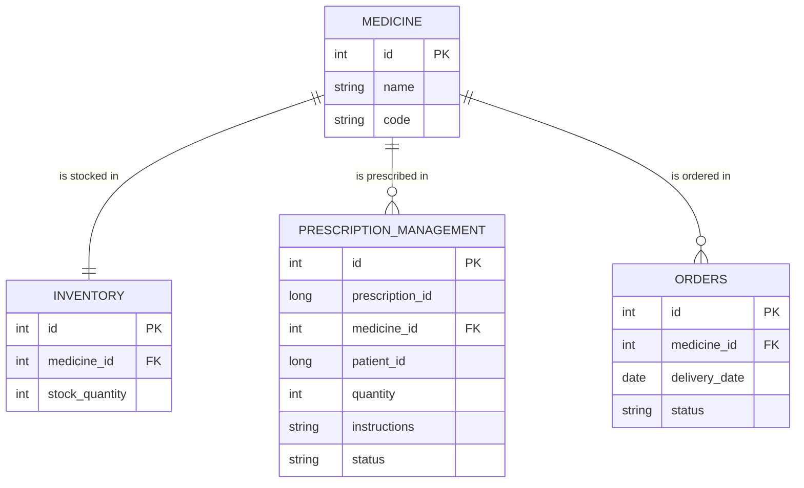

# TSG-10 Pharmacy API


## Table of Contents
- [Running in Development](#running-in-development)
- [Running in Production](#running-in-production)
- [API Endpoint Reference](#endpoint-reference)
  - [Medicine](#medicine-api---view-the-medicine-api-reference-file)
  - [Medication Inventory](#medication-inventory-api)
  - [Prescription Management](#prescription-management-api)
- [Entity Relationship Diagram](#entity-relationship-diagram)
- [System Architecture](#system-architecture)


## Running in Development
[Back to Table of Contents](#table-of-contents)

To enable hot-reloading
***Note***: As you make changes and save you will see the API rebuild.
```bash
IntelliJ IDEA:
Enable Auto-Make:
Go to File > Settings > Build, Execution, Deployment > Compiler.
Check "Build project automatically".
```
Start the Kafka service
```bash
docker-compose -f docker-compose.kafka.yml up -d
```

Start the API
```bash
gradlew bootRun
```

Run tests (terminal)

***Note***: You can view the report generated in ./build/reports/tests/test/index.html
```bash
gradlew test
```
Alternatively just use your IDE to run the tests with coverage.

## Running in Production
[Back to Table of Contents](#table-of-contents)

Set up the .env file
```dotenv
# PostgreSQL Database Configuration
POSTGRES_DB=pharmacy
POSTGRES_USER=postgres
POSTGRES_PASSWORD=password

# Spring Boot Application Configuration
SPRING_DATASOURCE_URL=jdbc:postgresql://postgres:5432/pharmacy
SPRING_DATASOURCE_USERNAME=postgres
SPRING_DATASOURCE_PASSWORD=password
SPRING_JPA_HIBERNATE_DDL_AUTO=create-drop
SPRING_PROFILES_ACTIVE=prod

# pgAdmin Configuration
PGADMIN_DEFAULT_EMAIL=admin@admin.com
PGADMIN_DEFAULT_PASSWORD=password

```
Run the API, Postgres, and the optional PgAdmin (DB GUI) Containers
```bash
docker compose up -d
```
If you need to take the system down and apply changes
```bash
docker compose down
docker compose --build -d
```

If you want to access the PgAdmin DB GUI easily you can create a JSON file to seed the necessary credentials and database details. You will also need to uncomment the PgAdmin script in docker-compose.yml.
Create a file in root called "pgadmin_db_seed_list.json".
```json
{
  "Servers": {
    "1": {
      "Name": "Pharmacy Database",
      "Group": "Servers",
      "Host": "postgres",
      "Port": 5432,
      "Username": "postgres",
      "SSLMode": "prefer",
      "MaintenanceDB": "pharmacy",
      "Password": "password"
    }
  }
}
```


# Endpoint References
[Back to Table of Contents](#table-of-contents)

## Inventory Reference
[Inventory Reference](./ApiReference/InventoryReference.md)

[Exception Reference](./ApiReference/ExceptionReference.md)


# Entity Relationship Diagram
[Back to Table of Contents](#table-of-contents)



# System Architecture
[Back to Table of Contents](#table-of-contents)
```mermaid

```

