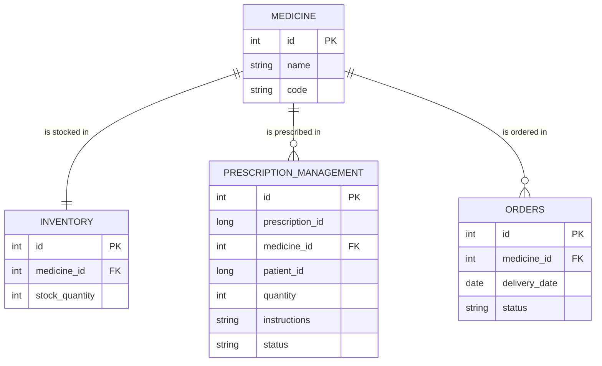

# TSG-10 Pharmacy API


## Table of Contents
- [Running in Development](#running-in-development)
- [Running in Production](#running-in-production)
- [API Endpoint Reference](#endpoint-reference)
  - [Medicine](#medicine-api---view-the-medicine-api-reference-file)
  - [Medication Inventory](#medication-inventory-api)
  - [Prescription Management](#prescription-management-api)
- [Entity Relationship Diagram](#entity-relationship-diagram)
- [System Architecture](#system-architecture)


## Running in Development
[Back to Table of Contents](#table-of-contents)

To enable hot-reloading
***Note***: As you make changes and save you will see the API rebuild.
```bash
IntelliJ IDEA:
Enable Auto-Make:
Go to File > Settings > Build, Execution, Deployment > Compiler.
Check "Build project automatically".
```

Start the API
```bash
gradlew bootRun
```

Run tests (terminal)

***Note***: You can view the report generated in ./build/reports/tests/test/index.html
```bash
gradlew test
```
Alternatively just use your IDE to run the tests with coverage.

## Running in Production
[Back to Table of Contents](#table-of-contents)
```
TBD
```
# Endpoint Reference
[Back to Table of Contents](#table-of-contents)


# Entity Relationship Diagram
[Back to Table of Contents](#table-of-contents)



# System Architecture
[Back to Table of Contents](#table-of-contents)
```mermaid

```

